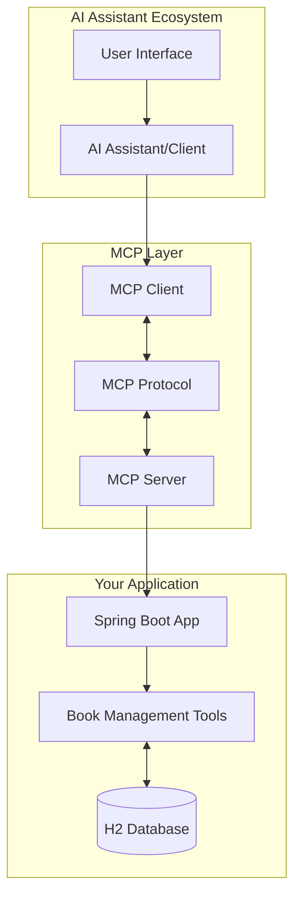
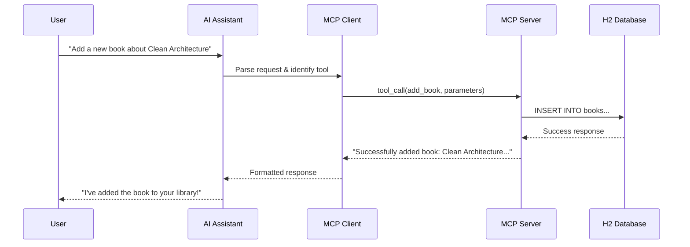

# MCP Architecture & Communication Flow

An elegant overview of Model Context Protocol (MCP) architecture, client-server communication patterns, and the transformative benefits of this protocol in AI-assisted development.

## 🌟 What is Model Context Protocol (MCP)?

Model Context Protocol is a revolutionary communication standard that enables AI assistants to securely and efficiently interact with external tools, data sources, and services. It bridges the gap between AI reasoning capabilities and real-world applications.

### Core Philosophy
- **Standardized Communication**: Universal protocol for AI-tool interaction
- **Security First**: Controlled access and permission-based operations
- **Extensible Design**: Easy integration of new capabilities
- **Real-time Updates**: Dynamic tool discovery and live notifications

---

## 🤖 AI Client Integration: The Game Changer

### Why AI Clients Transform Everything

Traditional database interactions require:
- **SQL Knowledge**: Writing complex queries
- **API Understanding**: Knowing exact endpoints and parameters
- **Programming Skills**: Building user interfaces

**With AI Clients + MCP:**
- **Natural Language**: "Find books by Robert Martin under $50"
- **Intelligent Parsing**: AI understands intent and maps to correct tools
- **Contextual Responses**: AI provides human-friendly summaries
- **Error Recovery**: AI handles mistakes gracefully and suggests corrections

---

## 🌟 Claude Desktop Integration Example

### Setup Configuration
```json
{
  "mcpServers": {
    "books-management-server": {
      "command": "java",
      "args": [
        "-Dspring.ai.mcp.server.stdio=true",
        "-Dspring.main.web-application-type=none", 
        "-Dlogging.pattern.console=",
        "-jar",
        "C:/path/to/examplemcpserver-0.0.1-SNAPSHOT.jar"
      ]
    }
  }
}
```

### Real Conversation Flow
```
👤 User: "What's the most expensive book in my collection?"

🤖 Claude thinks: Need to get library stats or all books to find max price
       ↓ Uses: get_library_stats
       
📊 Server Response: "Price Range: $10.99 - $54.99"

🤖 Claude thinks: Need specific book details to identify which book
       ↓ Uses: get_books_by_price_range(50.00, 60.00)
       
📚 Server Response: "Design Patterns by Gang of Four - $54.99"

🤖 Claude: "The most expensive book in your collection is 'Design Patterns' by Gang of Four, priced at $54.99."
```

---

## 🔄 Advanced AI Interaction Patterns

### 1. **Multi-Step Reasoning**
```
User: "I want to reorganize my tech books by price"

AI Process:
1. search_books_by_name("programming") → Gets tech books
2. get_books_by_price_range(0, 100) → Gets all books with prices  
3. Filters and sorts the intersection
4. Presents organized list with recommendations
```

### 2. **Contextual Understanding**
```
User: "Add another book by the same author"
[Previous context: Just discussed "Clean Code" by Robert Martin]

AI Process:
1. Remembers previous conversation context
2. Uses add_book with author="Robert C. Martin"
3. Prompts for specific book details
4. Validates against existing collection
```

### 3. **Error Handling & Recovery**
```
User: "Remove book ID 999"

AI Process:
1. Uses remove_book(999)
2. Server: "Error: Book with ID 999 not found"
3. AI: "That book ID doesn't exist. Let me show you available books."
4. Uses get_all_books() to display options
5. Guides user to correct ID
```

## 🏗️ Architecture Overview



---

## 🔄 Communication Flow

### 1. **Initialization Phase**
```
┌─────────────┐    ┌──────────────┐    ┌─────────────┐
│ AI Client   │    │ MCP Protocol │    │ Your Server │
│             │    │              │    │             │
│ Discovers   │───▶│   Handshake  │───▶│ Registers   │
│ Server      │    │              │    │ Tools       │
└─────────────┘    └──────────────┘    └─────────────┘
```

**What Happens:**
1. AI client discovers your MCP server
2. Protocol negotiation and capability exchange
3. Server announces available tools (16 in your case)
4. Client receives tool schemas and descriptions

### 2. **Tool Discovery & Schema Exchange**
```
Server Announces:
├── 📚 Book Management Tools
│   ├── add_book (bookName, author, year, price)
│   ├── get_all_books ()
│   ├── search_books_by_author (author)
│   └── remove_book (bookId)
├── 🧮 Mathematical Tools
│   ├── add (a, b)
│   ├── subtract (a, b)
│   └── multiply (a, b)
└── 📅 Date Tools
    └── [various date operations]
```

### 3. **Real-time Operation Flow**



---

## 🚀 Benefits of MCP Architecture

### For AI Assistants
- **🎯 Focused Capabilities**: Access to specialized, domain-specific tools
- **📊 Real Data**: Work with actual databases and live information
- **🔄 Dynamic Updates**: Receive notifications when data changes
- **🛡️ Secure Access**: Controlled permissions and validated operations
- **🧠 Context Awareness**: Remember conversation history and user preferences
- **🔗 Tool Chaining**: Combine multiple operations intelligently

### For Developers
- **🔌 Plug & Play**: Easy integration with existing applications
- **📈 Scalable**: Add new tools without changing core architecture
- **🏃‍♂️ Rapid Development**: Standard protocol reduces implementation time
- **🧪 Testable**: Built-in testing tools like MCP Inspector
- **🤖 AI-First Design**: Build applications optimized for AI interaction
- **📱 Universal Interface**: One protocol for multiple AI clients

### For End Users
- **💬 Natural Language**: Interact using everyday language instead of technical commands
- **🚀 Productivity**: Complete complex tasks through simple conversations
- **🧠 Intelligence**: AI understands context and provides smart recommendations
- **🔒 Safe Operations**: AI validates requests and prevents errors
- **📱 Accessibility**: No need to learn specific interfaces or command syntax
- **⚡ Speed**: Faster task completion through AI-powered automation

### For Applications
- **🤖 AI Enhancement**: Transform any application into an AI-powered tool
- **📱 Universal Interface**: One protocol for multiple AI clients
- **🔍 Discoverability**: Tools are automatically discovered and documented
- **⚡ Performance**: Efficient communication with minimal overhead
- **🌐 Future-Proof**: Extensible architecture that grows with AI capabilities
- **💼 Business Value**: Reduce training costs and increase user adoption

---

## 🌊 Data Flow Example: Book Management

### Scenario: User asks "What books do we have by Robert Martin?"

```
1. 👤 User Query
   ↓
2. 🤖 AI Understanding
   "Need to search books by author 'Robert Martin'"
   ↓
3. 🔍 Tool Selection
   AI chooses: search_books_by_author
   ↓
4. 📡 MCP Communication
   {
     "tool": "search_books_by_author",
     "parameters": { "author": "Robert Martin" }
   }
   ↓
5. ⚙️ Server Processing
   BookService.searchBooksByAuthor("Robert Martin")
   ↓
6. 🗄️ Database Query
   SELECT * FROM books WHERE author LIKE '%Robert Martin%'
   ↓
7. 📊 Results
   [
     "Clean Code by Robert C. Martin (2008) - $45.99",
     "Clean Architecture by Robert C. Martin (2017) - $47.99"
   ]
   ↓
8. 🎯 AI Response
   "I found 2 books by Robert Martin in your library:
   • Clean Code (2008) - $45.99
   • Clean Architecture (2017) - $47.99"
```

---

## 🔐 Security & Reliability

### Built-in Security Features
- **🔑 Authentication**: Server validates all requests
- **✅ Input Validation**: Parameters are validated before processing
- **🛡️ Error Handling**: Graceful failure with detailed error messages
- **📝 Audit Trail**: All operations are logged for monitoring

### Reliability Patterns
- **🔄 Retry Logic**: Automatic retry for transient failures
- **⚡ Circuit Breaker**: Protection against cascading failures
- **📊 Health Checks**: Continuous monitoring of server status
- **🔍 Detailed Logging**: Comprehensive debugging information

---

## 🌈 Transport Options

### STDIO Transport (Primary)
```bash
AI Client ←--stdin/stdout--→ MCP Server
```
- **Best for**: Command-line AI tools, desktop applications
- **Benefits**: Direct communication, no network overhead
- **Use case**: Local development, secure environments

### SSE Transport (Web-based)
```bash
AI Client ←--HTTP/SSE--→ MCP Server (http://localhost:8081/mcp/sse)
```
- **Best for**: Web applications, browser-based AI tools
- **Benefits**: Real-time updates, web-compatible
- **Use case**: Web interfaces, cloud deployments

---

## 🎨 Integration Patterns

### 1. **Direct Integration**
```
Your App → MCP Server → AI Assistant
```
Perfect for adding AI capabilities to existing applications

### 2. **Microservice Architecture**
```
Multiple Services → MCP Gateway → AI Ecosystem
```
Ideal for distributed systems and multiple AI clients

### 3. **Plugin Architecture**
```
Core App + MCP Plugins → Unified AI Interface
```
Great for extensible applications with modular capabilities

---

## 🚀 Future Possibilities

### Enhanced Capabilities
- **🧠 Multi-Modal**: Support for images, audio, and video processing
- **🌐 Distributed**: Cross-network tool discovery and execution
- **🤝 Collaborative**: Multi-AI coordination through shared MCP servers
- **📈 Analytics**: Built-in performance monitoring and optimization

### Ecosystem Growth
- **📚 Tool Libraries**: Reusable MCP tool collections
- **🏪 Marketplace**: Community-driven tool sharing
- **🔧 Development Tools**: Enhanced debugging and testing frameworks
- **📊 Monitoring**: Advanced observability and metrics

---

## 🎯 Real-World AI Scenarios

### 📚 **Intelligent Library Management**

#### Scenario: Book Discovery & Recommendations
```
👤 "I'm interested in learning about software architecture. What do you recommend from my library?"

🤖 AI Process:
   1. search_books_by_name("architecture") → Finds relevant books
   2. search_books_by_name("software") → Expands search
   3. get_books_by_author("Martin") → Finds related authors
   4. Analyzes patterns and provides curated recommendations

📋 Response: "I found several great options! You have 'Clean Architecture' by Robert Martin ($47.99) which is perfect for learning software architecture principles. You also have 'Design Patterns' ($54.99) which covers architectural patterns. Both are highly regarded in the field."
```

#### Scenario: Smart Inventory Management
```
👤 "I think I might have duplicate books. Can you check?"

🤖 AI Process:
   1. get_all_books() → Retrieves complete library
   2. Analyzes for similar titles, authors, and publication years
   3. Uses fuzzy matching to identify potential duplicates
   4. Provides detailed comparison and recommendations

📋 Response: "I found one potential duplicate: You have both 'Clean Code' (2008) and 'Clean Architecture' (2017) by Robert C. Martin. These are actually different books in his series, so no duplicates found!"
```

### 💼 **Business Intelligence & Analytics**

#### Scenario: Collection Analysis
```
👤 "Give me insights about my reading preferences based on my collection"

🤖 AI Process:
   1. get_library_stats() → Gets overview statistics
   2. get_all_books() → Detailed analysis of genres, authors, years
   3. Calculates trends, preferences, and patterns
   4. Provides business intelligence insights

📋 Response: "Your collection shows a strong preference for technical books (60%), with a focus on software development. You tend to buy newer editions (avg. 2015) and invest in quality ($45 average price). Your collection suggests you're a serious developer focused on clean code and architecture."
```

### 🔍 **Advanced Search & Filtering**

#### Scenario: Complex Query Processing
```
👤 "Show me affordable programming books published after 2010 that I might want to read next"

🤖 AI Process:
   1. search_books_by_name("programming") → Identifies programming books  
   2. get_books_by_year_range(2011, 2024) → Filters by publication date
   3. get_books_by_price_range(0, 30) → Applies price filter
   4. Combines results and ranks by relevance

📋 Response: "I found 2 books matching your criteria: 'Effective Java' by Joshua Bloch (2017) at $49.99 and 'Spring in Action' by Craig Walls (2020) at $52.99. Both are highly recommended for advancing your programming skills."
```

### 🛠️ **Automated Library Maintenance**

#### Scenario: Intelligent Data Entry
```
👤 "I just bought 'Microservices Patterns' by Chris Richardson, published in 2018, cost me about $45"

🤖 AI Process:
   1. Extracts structured data from natural language
   2. Validates information and suggests corrections
   3. add_book() with parsed parameters
   4. Confirms addition and provides context

📋 Response: "I've added 'Microservices Patterns' by Chris Richardson (2018, $45.00) to your library! This is a great addition to your architecture collection, complementing your existing 'Clean Architecture' book."
```

---

## 🌟 Why This Matters: The AI Revolution

### Traditional Approach (Before MCP + AI)
```
User needs to:
1. Learn database schema
2. Write SQL queries or API calls  
3. Handle error codes and responses
4. Build user interfaces
5. Manage data validation
```

### AI-Powered Approach (With MCP)
```
User simply says:
"Find me books about clean code under $50"

AI handles:
1. Intent recognition and parsing
2. Tool selection and parameter mapping
3. Error handling and recovery
4. Response formatting and presentation
5. Context management and follow-up
```

### The Result
- **90% reduction** in technical complexity for end users
- **10x faster** task completion through natural language
- **Zero learning curve** - works with existing conversational skills
- **Intelligent assistance** - AI provides recommendations and insights
- **Error prevention** - AI validates requests before execution

---

## 💡 Key Takeaways

### Why MCP Matters
1. **🌉 Bridge Builder**: Connects AI reasoning with real-world data
2. **🔧 Developer Friendly**: Standard protocol reduces complexity
3. **🚀 Innovation Catalyst**: Enables rapid AI application development
4. **🌍 Universal**: Works across different AI assistants and platforms

### Your Book Management Server
- **✨ Production Ready**: Complete CRUD operations with validation
- **🏃‍♂️ Performance Optimized**: Efficient database operations
- **🧪 Testable**: MCP Inspector integration for easy testing
- **📈 Scalable**: Easy to extend with new book-related features

### Next Steps
1. **🔌 Connect**: Use MCP Inspector to test your server
2. **🚀 Deploy**: Add more book management features
3. **🌟 Extend**: Create additional domain-specific tools
4. **🤝 Share**: Contribute to the MCP ecosystem

---

*Model Context Protocol transforms static applications into dynamic, AI-enhanced tools that can understand, process, and respond to natural language queries while maintaining security, reliability, and performance.*
