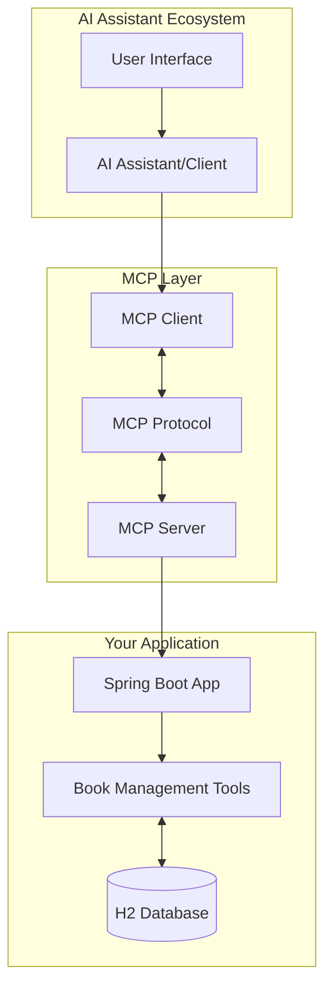
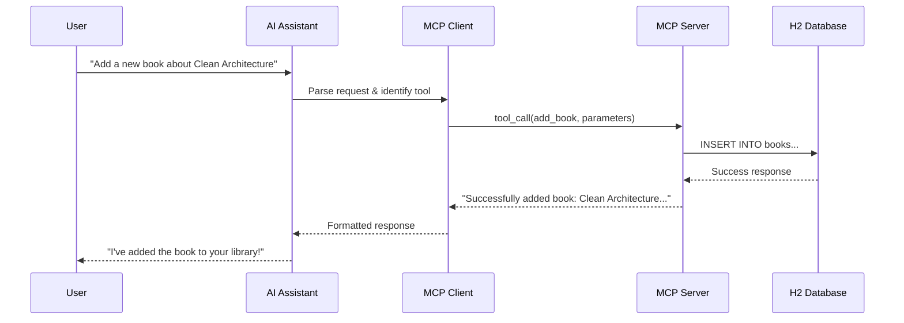

# MCP Architecture & Communication Flow

An elegant overview of Model Context Protocol (MCP) architecture, client-server communication patterns, and the transformative benefits of this protocol in AI-assisted development.

## 🌟 What is Model Context Protocol (MCP)?

Model Context Protocol is a revolutionary communication standard that enables AI assistants to securely and efficiently interact with external tools, data sources, and services. It bridges the gap between AI reasoning capabilities and real-world applications.

### Core Philosophy
- **Standardized Communication**: Universal protocol for AI-tool interaction
- **Security First**: Controlled access and permission-based operations
- **Extensible Design**: Easy integration of new capabilities
- **Real-time Updates**: Dynamic tool discovery and live notifications

---

## 🏗️ Architecture Overview



---

## 🔄 Communication Flow

### 1. **Initialization Phase**
```
┌─────────────┐    ┌──────────────┐    ┌─────────────┐
│ AI Client   │    │ MCP Protocol │    │ Your Server │
│             │    │              │    │             │
│ Discovers   │───▶│   Handshake  │───▶│ Registers   │
│ Server      │    │              │    │ Tools       │
└─────────────┘    └──────────────┘    └─────────────┘
```

**What Happens:**
1. AI client discovers your MCP server
2. Protocol negotiation and capability exchange
3. Server announces available tools (16 in your case)
4. Client receives tool schemas and descriptions

### 2. **Tool Discovery & Schema Exchange**
```
Server Announces:
├── 📚 Book Management Tools
│   ├── add_book (bookName, author, year, price)
│   ├── get_all_books ()
│   ├── search_books_by_author (author)
│   └── remove_book (bookId)
├── 🧮 Mathematical Tools
│   ├── add (a, b)
│   ├── subtract (a, b)
│   └── multiply (a, b)
└── 📅 Date Tools
    └── [various date operations]
```

### 3. **Real-time Operation Flow**



---

## 🚀 Benefits of MCP Architecture

### For AI Assistants
- **🎯 Focused Capabilities**: Access to specialized, domain-specific tools
- **📊 Real Data**: Work with actual databases and live information
- **🔄 Dynamic Updates**: Receive notifications when data changes
- **🛡️ Secure Access**: Controlled permissions and validated operations

### For Developers
- **🔌 Plug & Play**: Easy integration with existing applications
- **📈 Scalable**: Add new tools without changing core architecture
- **🏃‍♂️ Rapid Development**: Standard protocol reduces implementation time
- **🧪 Testable**: Built-in testing tools like MCP Inspector

### For Applications
- **🤖 AI Enhancement**: Transform any application into an AI-powered tool
- **📱 Universal Interface**: One protocol for multiple AI clients
- **🔍 Discoverability**: Tools are automatically discovered and documented
- **⚡ Performance**: Efficient communication with minimal overhead

---

## 🌊 Data Flow Example: Book Management

### Scenario: User asks "What books do we have by Robert Martin?"

```
1. 👤 User Query
   ↓
2. 🤖 AI Understanding
   "Need to search books by author 'Robert Martin'"
   ↓
3. 🔍 Tool Selection
   AI chooses: search_books_by_author
   ↓
4. 📡 MCP Communication
   {
     "tool": "search_books_by_author",
     "parameters": { "author": "Robert Martin" }
   }
   ↓
5. ⚙️ Server Processing
   BookService.searchBooksByAuthor("Robert Martin")
   ↓
6. 🗄️ Database Query
   SELECT * FROM books WHERE author LIKE '%Robert Martin%'
   ↓
7. 📊 Results
   [
     "Clean Code by Robert C. Martin (2008) - $45.99",
     "Clean Architecture by Robert C. Martin (2017) - $47.99"
   ]
   ↓
8. 🎯 AI Response
   "I found 2 books by Robert Martin in your library:
   • Clean Code (2008) - $45.99
   • Clean Architecture (2017) - $47.99"
```

---

## 🔐 Security & Reliability

### Built-in Security Features
- **🔑 Authentication**: Server validates all requests
- **✅ Input Validation**: Parameters are validated before processing
- **🛡️ Error Handling**: Graceful failure with detailed error messages
- **📝 Audit Trail**: All operations are logged for monitoring

### Reliability Patterns
- **🔄 Retry Logic**: Automatic retry for transient failures
- **⚡ Circuit Breaker**: Protection against cascading failures
- **📊 Health Checks**: Continuous monitoring of server status
- **🔍 Detailed Logging**: Comprehensive debugging information

---

## 🌈 Transport Options

### STDIO Transport (Primary)
```bash
AI Client ←--stdin/stdout--→ MCP Server
```
- **Best for**: Command-line AI tools, desktop applications
- **Benefits**: Direct communication, no network overhead
- **Use case**: Local development, secure environments

### SSE Transport (Web-based)
```bash
AI Client ←--HTTP/SSE--→ MCP Server (http://localhost:8081/mcp/sse)
```
- **Best for**: Web applications, browser-based AI tools
- **Benefits**: Real-time updates, web-compatible
- **Use case**: Web interfaces, cloud deployments

---

## 🎨 Integration Patterns

### 1. **Direct Integration**
```
Your App → MCP Server → AI Assistant
```
Perfect for adding AI capabilities to existing applications

### 2. **Microservice Architecture**
```
Multiple Services → MCP Gateway → AI Ecosystem
```
Ideal for distributed systems and multiple AI clients

### 3. **Plugin Architecture**
```
Core App + MCP Plugins → Unified AI Interface
```
Great for extensible applications with modular capabilities

---

## 🚀 Future Possibilities

### Enhanced Capabilities
- **🧠 Multi-Modal**: Support for images, audio, and video processing
- **🌐 Distributed**: Cross-network tool discovery and execution
- **🤝 Collaborative**: Multi-AI coordination through shared MCP servers
- **📈 Analytics**: Built-in performance monitoring and optimization

### Ecosystem Growth
- **📚 Tool Libraries**: Reusable MCP tool collections
- **🏪 Marketplace**: Community-driven tool sharing
- **🔧 Development Tools**: Enhanced debugging and testing frameworks
- **📊 Monitoring**: Advanced observability and metrics

---

## 💡 Key Takeaways

### Why MCP Matters
1. **🌉 Bridge Builder**: Connects AI reasoning with real-world data
2. **🔧 Developer Friendly**: Standard protocol reduces complexity
3. **🚀 Innovation Catalyst**: Enables rapid AI application development
4. **🌍 Universal**: Works across different AI assistants and platforms

### Your Book Management Server
- **✨ Production Ready**: Complete CRUD operations with validation
- **🏃‍♂️ Performance Optimized**: Efficient database operations
- **🧪 Testable**: MCP Inspector integration for easy testing
- **📈 Scalable**: Easy to extend with new book-related features

### Next Steps
1. **🔌 Connect**: Use MCP Inspector to test your server
2. **🚀 Deploy**: Add more book management features
3. **🌟 Extend**: Create additional domain-specific tools
4. **🤝 Share**: Contribute to the MCP ecosystem

---

*Model Context Protocol transforms static applications into dynamic, AI-enhanced tools that can understand, process, and respond to natural language queries while maintaining security, reliability, and performance.*
